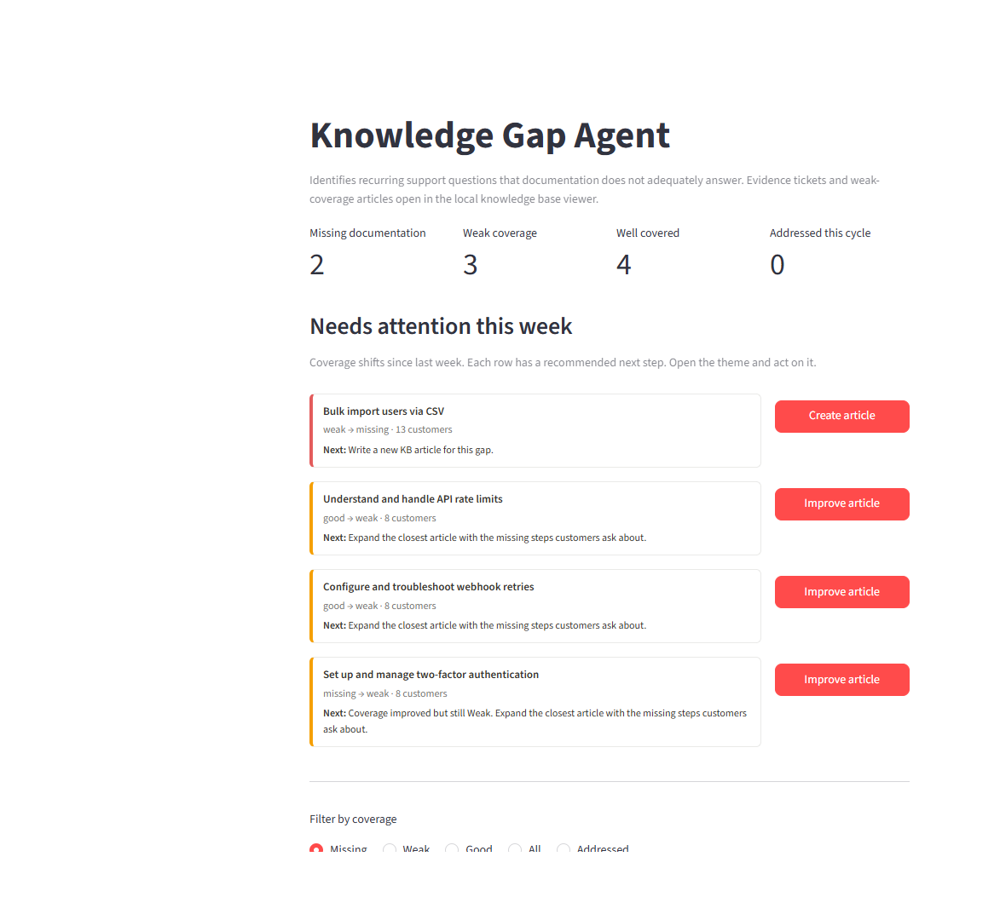
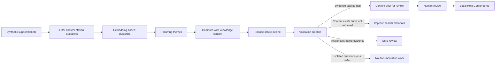

# AI Knowledge Gap Agent

[](https://github.com/Yufereva/ai-knowledge-gap-agent/actions/workflows/tests.yml)

A portfolio prototype that analyzes support conversations to identify missing,
outdated, or inconsistent knowledge across help center content, macros,
runbooks, and internal documentation.

## Why This Matters

Support teams repeatedly answer questions that should already be covered by
self-service content. Those requests are often scattered across many tickets,
so content teams do not see the pattern or know which article to improve. This
agent turns recurring synthetic support questions into ranked, evidence-backed
content recommendations.

## Project Status

Portfolio MVP. The repository is a standalone local Streamlit application with
bundled synthetic tickets, synthetic knowledge base articles, an embedding
pipeline, and automated tests.

## Synthetic Data Notice

All demo data is synthetic. No customer or employer data is included.

The repository contains no production integrations, credentials, private URLs,
or real support conversations.

## Screenshot



## Demo

The dashboard classifies nine recurring documentation themes as good, weak, or
missing coverage. Reviewers can inspect each synthetic evidence ticket, open the
closest synthetic article, generate an optional local draft with Ollama, and
publish the reviewed result to the app's local Help Center view.

## Product Workflow



## Current Capabilities

- Filters product defects out of documentation-gap analysis.
- Clusters semantically similar support questions.
- Drops low-evidence topics.
- Classifies knowledge coverage as good, weak, or missing.
- Ranks gaps by coverage and ticket volume.
- Links every recommendation to local synthetic evidence tickets.
- Validates every proposed outline before a content owner sees it, and withholds
  outlines that evidence does not support.
- Separates a documentation gap from a findability problem, a retrieval failure,
  an outdated article, and a product defect.
- Recommends updating an existing article instead of publishing a near duplicate.
- Drafts a structured content brief for validated gaps.
- Optionally generates a fuller article with local Ollama.
- Supports local review, publication, editing, and unpublishing.
- Tracks addressed themes and weekly coverage changes in ignored runtime files.

## Validation Pipeline

Recurring questions are not proof that documentation is missing. The same ticket
volume can mean the article does not exist, exists but is never returned by
search, describes older product behavior, or that the product is simply broken.
Sending all of those to a content owner as "write an article" is the expensive
failure mode, so a validation pipeline runs between outline generation and human
review. Each stage lives in its own module under `validators/`, exposes
`validate()`, and returns a `ValidationResult` with the numbers behind its
verdict.

| Stage | Question it answers | Blocks the outline |
|---|---|---|
| `evidence_validator` | Which tickets support each outline section? | Yes, if no section has support |
| `threshold_validator` | Is this recurring across accounts and over time? | Yes, below 5 tickets, 3 accounts, or 14 days |
| `gap_classifier` | Is this missing content, poor findability, a retrieval failure, an outdated article, or a defect? | Yes, for everything except missing and partial coverage |
| `duplicate_validator` | Does an article already cover this? | Yes, above 75 percent overlap |
| `completeness_validator` | Which concepts customers raised does the outline omit? | No, it names the sections to add |
| `contradiction_validator` | Does the closest article contradict what customers report on a newer version? | Yes, it routes to an SME |

`validation_report.build_report` runs the stages, applies a fixed precedence, and
returns one explainable recommendation: `Present to Content Owner`,
`Update Existing Article`, `Needs SME Review`, `Improve Search Metadata`,
`Insufficient Evidence`, or `Reject`. Sections without supporting tickets are
withheld from the outline and marked for SME validation instead of being shown
as if customers had asked for them.

On the bundled dataset, four of the nine themes reach a content owner and five
are redirected:

| Theme | Gap class | Recommendation |
|---|---|---|
| Bulk import users via CSV | Missing Content | Present to Content Owner |
| Migrate from a legacy billing plan | Missing Content | Present to Content Owner |
| Two-factor authentication, API rate limits, CSV export | Partial Coverage | Update Existing Article |
| Configure and troubleshoot webhook retries | Outdated Documentation | Needs SME Review |
| Reset and rotate API keys | Poor Findability | Improve Search Metadata |
| Configure workspace time zones | Agent Retrieval Failure | Improve Search Metadata |
| Configure single sign-on | Partial Coverage | Reject as duplicate |

Two deliberate design choices are worth naming. Outline completeness never
blocks review: concept detection is lexical, and an outline written as customer
questions legitimately lacks procedural wording, so blocking there would reject
real gaps. Contradiction detection is a narrow deterministic rule set paired with
product version data, not general purpose entailment, because a false
contradiction is as costly as a missed one.

## Demo Scenario

1. Start the Streamlit app.
2. Review the missing, weak, and good coverage totals.
3. Open **Needs attention this week** and follow a recommended action.
4. Inspect a missing theme such as **Bulk import users via CSV**.
5. Read the validation verdict, then open **Validation report** to see each stage.
6. Compare it with **Configure and troubleshoot webhook retries**, where no draft
   is offered because the closest article contradicts the evidence.
7. Open the bundled evidence tickets and proposed article outline.
8. Generate a draft with Ollama, or review the content brief without Ollama.
9. Publish an approved draft to the local Help Center page.
10. Edit, republish, unpublish, or mark the theme as addressed.

## Quick Start

```bash
git clone https://github.com/Yufereva/ai-knowledge-gap-agent.git
cd ai-knowledge-gap-agent
python -m venv .venv
```

Activate the environment, then install and run:

```bash
python -m pip install -r requirements.txt
streamlit run app.py
```

The synthetic dataset is already included. Regenerate it deterministically when
needed:

```bash
python scripts/generate_dataset.py
```

Run the checks:

```bash
python -m ruff check .
python -m pytest -q
```

Optional local article generation:

```bash
ollama pull llama3.2
```

Ollama must be available at `http://localhost:11434`. No ticket evidence is sent
to a cloud model.

## How It Works

`knowledge_gap.py` loads the bundled synthetic ticket and article JSON files,
embeds their text with `all-MiniLM-L6-v2`, groups recurring questions, and
compares each theme centroid with the available articles. Hand-tuned thresholds
separate good, weak, and missing coverage for the synthetic benchmark.

`validators/` then decides whether documentation work is justified. It reads the
fields that cannot be derived from ticket text: the account that filed each
ticket, the product version it came from, and whether self-service search
returned the right article. Those fields are part of the synthetic dataset in
`scripts/generate_dataset.py`.

`review_store.py` keeps reviewer state in ignored local JSON files.
`ollama_draft.py` builds a constrained article prompt and calls local Ollama only
when the reviewer requests a draft. `app.py` provides the dashboard, evidence
ticket view, article viewer, and local Help Center publishing flow.

## Privacy And Human Review

All included tickets, article content, people, organizations, identifiers, and
product details are fictional. Generated drafts are labeled for review and may
contain incorrect product details. A human content owner must verify every
procedure and policy before using the recommendation outside this demo.

## Current Limitations

- Thresholds are calibrated on a synthetic dataset, not production ticket
  volume.
- Greedy clustering can group overlapping questions imperfectly.
- Ticket type is treated as an upstream signal and may be wrong in real data.
- Semantic similarity does not prove that an article is factually correct.
- Search outcomes, account identifiers, and product versions are synthetic. A real
  deployment would need help center search analytics and CRM data.
- The support threshold has no customer impact signal, so it relies on the
  time-span rule instead of the impact override.
- Completeness and contradiction checks are keyword based, so they can miss a
  paraphrase and cannot judge product facts.
- Local publishing does not update a real help center.
- Optional Ollama output can still invent unsupported details.

See [docs/limitations.md](docs/limitations.md) for the detailed review boundary.

## Future Improvements

- Evaluate clustering and coverage thresholds on a larger labeled benchmark.
- Broaden contradiction detection beyond the current rule family, and calibrate it
  against SME decisions.
- Compare help center articles with macros, runbooks, and internal docs.
- Add content-owner assignment and review states.
- Add optional authenticated sandbox adapters for helpdesk and knowledge tools.

## Related Portfolio Projects

- [AI Support Trend Detection](https://github.com/Yufereva/ai-support-trends-detection)
- [AI Escalation Quality Agent](https://github.com/Yufereva/ai-escalation-quality-agent)
- [Support Ops AI Agent Portfolio](https://github.com/Yufereva/support-ops-ai-agent-portfolio)

## License

MIT. See [LICENSE](LICENSE).
