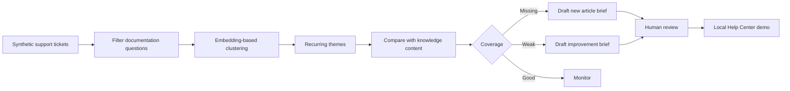

# AI Knowledge Gap Agent

A portfolio prototype that analyzes support conversations to identify missing,
outdated, or inconsistent knowledge across help center content, macros,
runbooks, and internal documentation.

## Why This Matters

Support teams repeatedly answer questions that should already be covered by
self-service content. Those requests are often scattered across many tickets,
so content teams do not see the pattern or know which article to improve. This
agent turns recurring synthetic support questions into ranked, evidence-backed
content recommendations.

## Project Status

Portfolio MVP. The repository is a standalone local Streamlit application with
bundled synthetic tickets, synthetic knowledge base articles, an embedding
pipeline, and automated tests.

## Synthetic Data Notice

All demo data is synthetic. No customer or employer data is included.

The repository contains no production integrations, credentials, private URLs,
or real support conversations.

## Demo

The dashboard classifies nine recurring documentation themes as good, weak, or
missing coverage. Reviewers can inspect each synthetic evidence ticket, open the
closest synthetic article, generate an optional local draft with Ollama, and
publish the reviewed result to the app's local Help Center view.

## Product Workflow



## Current Capabilities

- Filters product defects out of documentation-gap analysis.
- Clusters semantically similar support questions.
- Drops low-evidence topics.
- Classifies knowledge coverage as good, weak, or missing.
- Ranks gaps by coverage and ticket volume.
- Links every recommendation to local synthetic evidence tickets.
- Drafts a structured content brief for missing and weak coverage.
- Optionally generates a fuller article with local Ollama.
- Supports local review, publication, editing, and unpublishing.
- Tracks addressed themes and weekly coverage changes in ignored runtime files.

## Demo Scenario

1. Start the Streamlit app.
2. Review the missing, weak, and good coverage totals.
3. Open **Needs attention this week** and follow a recommended action.
4. Inspect a missing theme such as **Bulk import users via CSV**.
5. Open the bundled evidence tickets and proposed article outline.
6. Generate a draft with Ollama, or review the content brief without Ollama.
7. Publish an approved draft to the local Help Center page.
8. Edit, republish, unpublish, or mark the theme as addressed.

## Quick Start

```bash
git clone https://github.com/Yufereva/ai-knowledge-gap-agent.git
cd ai-knowledge-gap-agent
python -m venv .venv
```

Activate the environment, then install and run:

```bash
python -m pip install -r requirements.txt
streamlit run app.py
```

The synthetic dataset is already included. Regenerate it deterministically when
needed:

```bash
python scripts/generate_dataset.py
```

Run validation:

```bash
python -m ruff check .
python -m pytest -q
```

Optional local article generation:

```bash
ollama pull llama3.2
```

Ollama must be available at `http://localhost:11434`. No ticket evidence is sent
to a cloud model.

## How It Works

`knowledge_gap.py` loads the bundled synthetic ticket and article JSON files,
embeds their text with `all-MiniLM-L6-v2`, groups recurring questions, and
compares each theme centroid with the available articles. Hand-tuned thresholds
separate good, weak, and missing coverage for the synthetic benchmark.

`review_store.py` keeps reviewer state in ignored local JSON files.
`ollama_draft.py` builds a constrained article prompt and calls local Ollama only
when the reviewer requests a draft. `app.py` provides the dashboard, evidence
ticket view, article viewer, and local Help Center publishing flow.

## Privacy And Human Review

All included tickets, article content, people, organizations, identifiers, and
product details are fictional. Generated drafts are labeled for review and may
contain incorrect product details. A human content owner must verify every
procedure and policy before using the recommendation outside this demo.

## Current Limitations

- Thresholds are calibrated on a synthetic dataset, not production ticket
  volume.
- Greedy clustering can group overlapping questions imperfectly.
- Ticket type is treated as an upstream signal and may be wrong in real data.
- Semantic similarity does not prove that an article is factually correct.
- Local publishing does not update a real help center.
- Optional Ollama output can still invent unsupported details.

See [docs/limitations.md](docs/limitations.md) for the detailed review boundary.

## Future Improvements

- Evaluate clustering and coverage thresholds on a larger labeled benchmark.
- Detect stale or contradictory instructions, not only missing coverage.
- Compare help center articles with macros, runbooks, and internal docs.
- Add content-owner assignment and review states.
- Add optional authenticated sandbox adapters for helpdesk and knowledge tools.

## Related Portfolio Projects

- [AI Support Trend Detection](https://github.com/Yufereva/ai-support-trends-detection)
- [AI Escalation Quality Agent](https://github.com/Yufereva/ai-escalation-quality-agent)
- [Support Ops AI Agent Portfolio](https://github.com/Yufereva/support-ops-ai-agent-portfolio)

## License

MIT. See [LICENSE](LICENSE).
